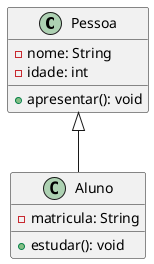

---

# 🧭 **Histórico Estendido da Engenharia de Software Auxiliada por Computador (CASE)**

A Engenharia de Software Auxiliada por Computador (CASE — *Computer-Aided Software Engineering*) representa o conjunto de ferramentas, métodos e ambientes computacionais criados para dar suporte ao desenvolvimento de software de forma sistemática, padronizada e produtiva. Ela nasce da necessidade de controlar a crescente complexidade dos sistemas, reduzir erros e aumentar a produtividade das equipes.

---

# 📜 **1. Origem (anos 1960–1970)**

### 💡 Contexto tecnológico

Nos anos 60 e 70, o desenvolvimento de software era artesanal. O hardware evoluía rápido, mas o software não acompanhava, tornando-se caro, lento e repleto de falhas.

👉 Esse período ficou conhecido como **Crise do Software**.

### 🧰 Primeiras ferramentas CASE rudimentares

* Editores básicos de texto.
* Compiladores simples.
* Linters iniciais.
* Ferramentas gráficas de fluxogramas.

Embora rudimentares, essas ferramentas mostraram que era possível automatizar partes do processo.

---

# 📈 **2. Consolidação (anos 1980)**

Os anos 80 marcam a explosão das primeiras ferramentas CASE reais.

### 🚀 Fatores que impulsionaram:

* Popularização dos computadores pessoais.
* Avanço da análise estruturada.
* Notações formais como **DFD** (Diagrama de Fluxo de Dados) e **ER** (Entidade-Relacionamento).

### 🛠️ Ferramentas marcantes

* **Excelerator (1985)** — Edifício completo de DFDs.
* **IE Case Tools** de Yourdon/DeMarco.
* Suporte a **documentação automática**.
* Primeiras bases de **repositórios compartilhados**.

Essas ferramentas permitiam criar modelos gráficos e gerar documentação consistente.

---

# 🔁 **3. Integração e Reengenharia (anos 1990)**

Nos anos 90 surgem:

### 💥 *Upper CASE*

Ferramentas para **análise e projeto** (DFD, ER, diagramas estruturados).

### 💥 *Lower CASE*

Ferramentas para **implementação** (geradores de código, teste, depuração).

### 📦 *I-CASE (Integrated CASE)*

Integração total do ciclo de vida:

* Modelagem
* Projeto
* Codificação
* Teste
* Documentação
* Reengenharia

🌟 O surgimento da **UML (1997)** foi decisivo:
→ Unificou notações
→ Permitiu ferramentas como Rational Rose

---

# 🌐 **4. Era UML, RUP e Ambientes Corporativos (2000–2010)**

Nos anos 2000, os CASE evoluem para plataformas completas:

### Exemplos:

* **Rational Rose / IBM Rational**
* **Enterprise Architect**
* **Visual Paradigm**

### Características:

* Geração de código Java, C++, C#.
* Engenharia **reversa** automática.
* Simulações UML.
* Modelos persistidos em repositórios.
* Suporte ao processo **RUP**.

---

# ☁️ **5. CASE Moderno (2010–2025)**

O CASE moderno vai além do diagrama:

### ✨ Características da nova geração:

* **Modelos colaborativos em nuvem**.
* **Code-first + Model-sync** (o modelo acompanha o código automaticamente).
* **DevOps e CI/CD integrados**.
* Engenharia de software auxiliada por:

  * IA generativa (ChatGPT, Copilot)
  * Analítica automatizada
  * Smarther UML
* Ferramentas SaaS como:

  * **Lucidchart**
  * **Draw.io**
  * **PlantUML + GitHub**
  * **StarUML**
  * **Codeium / Copilot**

### 💡 Nova perspectiva

Hoje, o CASE é parte da cultura DevOps e do pipeline de engenharia.
Não é apenas “desenhar diagramas”; é manter *modelos vivos*.

---

# 🕰️ **Linha do Tempo Resumida**

| Ano           | Marco Histórico                                            |
| ------------- | ---------------------------------------------------------- |
| **1968**      | Relatório NATO → Crise do Software                         |
| **1970**      | Primeiras ferramentas gráficas de fluxograma               |
| **1985**      | Ferramentas CASE populares (IE, Excelerator)               |
| **1986**      | Yourdon/DeMarco consolidam análise estruturada             |
| **1990**      | Surgimento dos ambientes I-CASE                            |
| **1997**      | Criação da UML (Booch, Rumbaugh, Jacobson)                 |
| **2000**      | Rational Rose e RUP dominam o mercado                      |
| **2010**      | CASE migrando para web/cloud                               |
| **2020**      | Integração com DevOps, CI/CD e engenharia reversa avançada |
| **2023–2025** | Modelagem automatizada via IA — “Modelos vivos”            |

---

# 📊 **Tabela Comparativa: CASE Clássico × CASE Moderno**

| Aspecto            | CASE Clássico (1980–2000)       | CASE Moderno (2010–2025)                |
| ------------------ | ------------------------------- | --------------------------------------- |
| Foco               | Modelagem gráfica               | Integração total com código e DevOps    |
| Tecnologia         | Desktop, arquivos locais        | Cloud, SaaS, Git, IA                    |
| Geração de código  | Parcial e rígida                | Completa, dinâmica, bidirecional        |
| Engenharia reversa | Limitada                        | Automatizada e sincronizada             |
| Modelos usados     | DFD, ER, diagramas estruturados | UML, BPMN, DSLs, Code Maps              |
| Colaboração        | Baixa                           | Tempo real, multiusuário                |
| Integração         | Pouca integração                | Git, pipelines, testes automáticos      |
| Uso de IA          | Nenhum                          | Assistentes automáticos, geração de UML |

---

# 🧪 **Exemplos em Java e UML Gerados Automaticamente**

A seguir, mostro **um pequeno modelo UML** convertido em **Java automaticamente**, como uma ferramenta CASE moderna faria.

---

## 🎯 **Exemplo UML (texto PlantUML)**



---

## 📌 **Código Java Gerado Automaticamente por CASE**

```java
public class Pessoa {
    private String nome;
    private int idade;

    public void apresentar() {
        System.out.println("Olá, meu nome é " + nome);
    }
}

public class Aluno extends Pessoa {
    private String matricula;

    public void estudar() {
        System.out.println("Aluno estudando...");
    }
}
```

---

# 🧠 **Exemplo: Geração automática a partir de código → UML**

Ferramentas CASE modernas podem transformar este código:

```java
public class Pedido {
    private int id;
    private Cliente cliente;

    public void fecharPedido() {}
}
```

Em um diagrama UML automaticamente.

```
Pedido --> Cliente : associação
```

---
