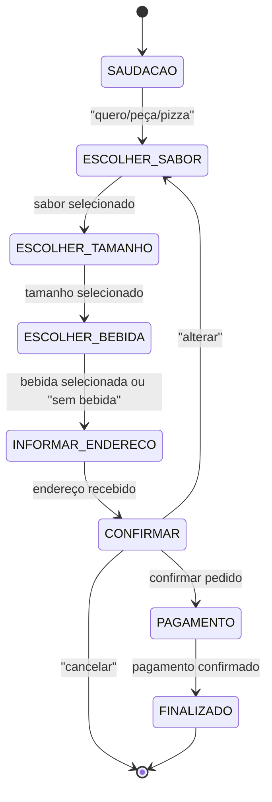

# 🍕 Chatbot de Pedidos de Pizza com Autômato Finito Determinístico (DFA)

## 1) Resumo do Tema
**Título:** Chatbot de Pedidos de Pizza com Autômato Finito Determinístico (DFA)  
**Objetivo:** Demonstrar estados, transições e ações usando um DFA que guia o usuário da saudação até a confirmação do pedido (sabor, tamanho, bebida, endereço) e finalização.

---

## 2) Diagrama de Estados (Mermaid)


---

## 3) Tabela de Estados e Transições

| Estado | Ação do Usuário | Próximo Estado |
|--------|-----------------|----------------|
| SAUDACAO | Dizer "quero pedir pizza" | ESCOLHER_SABOR |
| ESCOLHER_SABOR | Escolher sabor | ESCOLHER_TAMANHO |
| ESCOLHER_TAMANHO | Escolher tamanho | ESCOLHER_BEBIDA |
| ESCOLHER_BEBIDA | Escolher bebida | INFORMAR_ENDERECO |
| INFORMAR_ENDERECO | Informar endereço e telefone | CONFIRMAR |
| CONFIRMAR | Confirmar pedido | PAGAMENTO |
| CONFIRMAR | Alterar pedido | ESCOLHER_SABOR |
| CONFIRMAR | Cancelar pedido | Fim |
| PAGAMENTO | Escolher forma de pagamento | FINALIZADO |
| FINALIZADO | - | Fim |

---

## 4) Exemplo de Diálogo

**Usuário:** “Olá, quero pedir uma pizza.”  
**Bot:** “Ótimo! Qual sabor você quer?”  
**Usuário:** “Calabresa.”  
**Bot:** “Qual tamanho? pequena/média/grande”  
**Usuário:** “Média.”  
**Bot:** “Deseja bebida?”  
**Usuário:** “Coca-Cola 2L.”  
**Bot:** “Qual o endereço para entrega?”  
**Usuário:** “Rua A, 123 — João — 99999-9999”  
**Bot:** “Confirma: Pizza Calabresa (média) + Coca-Cola 2L — Entrega em Rua A, 123 — Confirmar/Alterar/Cancelar”  
**Usuário:** “Confirmar”  
**Bot:** “Como deseja pagar? dinheiro/cartão”  
**Usuário:** “Cartão”  
**Bot:** “Pedido confirmado! Chegará em ~30 minutos. Obrigado!”  

---

## 5) Código em Python

```python
#!/usr/bin/env python3
# chatbot_pizza_dfa.py
import re

def ask(prompt):
    return input(prompt + "\n> ").strip().lower()

SABORES = ["calabresa","mussarela","portuguesa","frango"]
TAMANHOS = ["pequena","média","media","grande"]
BEBIDAS_KEYWORDS = ["coca","fanta","pepsi","suco","água","agua","sem"]

def extract_keyword(text, options):
    for opt in options:
        if opt in text:
            return opt
    return None

def main():
    state = "SAUDACAO"
    pedido = {"sabor": None, "tamanho": None, "bebida": None, "endereco": None, "pagamento": None}
    print("Bot: Olá! Sou o Pizzabot. Diga 'quero pedir' para começar.")
    while True:
        if state == "SAUDACAO":
            txt = ask("Você")
            if re.search(r"\b(quero|pedir|pedido|pizza)\b", txt):
                state = "ESCOLHER_SABOR"
                print("Bot: Que sabor você quer? (calabresa, mussarela, portuguesa, frango)")
            else:
                print("Bot: Diga 'quero pedir' quando quiser fazer um pedido.")
        elif state == "ESCOLHER_SABOR":
            txt = ask("Informe o sabor")
            s = extract_keyword(txt, SABORES)
            if s:
                pedido["sabor"] = s
                state = "ESCOLHER_TAMANHO"
                print(f"Bot: {s.capitalize()} escolhido. Qual o tamanho? (pequena/média/grande)")
            else:
                print("Bot: Não entendi o sabor. Opções: calabresa, mussarela, portuguesa, frango.")
        elif state == "ESCOLHER_TAMANHO":
            txt = ask("Informe o tamanho")
            t = extract_keyword(txt, TAMANHOS)
            if t:
                pedido["tamanho"] = "média" if t in ("media","média") else t
                state = "ESCOLHER_BEBIDA"
                print("Bot: Deseja bebida? Diga o nome ou 'sem bebida'.")
            else:
                print("Bot: Tamanhos válidos: pequena, média, grande.")
        elif state == "ESCOLHER_BEBIDA":
            txt = ask("Bebida (ou 'sem')").lower()
            if "sem" in txt:
                pedido["bebida"] = "sem bebida"
                state = "INFORMAR_ENDERECO"
                print("Bot: OK, sem bebida. Qual o endereço para entrega?")
            else:
                found = None
                for kw in BEBIDAS_KEYWORDS:
                    if kw in txt:
                        found = txt
                        break
                pedido["bebida"] = found if found else txt
                state = "INFORMAR_ENDERECO"
                print("Bot: Entendi. Agora me diga o endereço e telefone.")
        elif state == "INFORMAR_ENDERECO":
            txt = ask("Endereço e telefone")
            if len(txt) > 5:
                pedido["endereco"] = txt
                state = "CONFIRMAR"
            else:
                print("Bot: Informe um endereço válido (rua, número, telefone).")
        elif state == "CONFIRMAR":
            resumo = (f"{pedido['sabor'].capitalize()} ({pedido['tamanho']}) - "
                      f"{pedido['bebida']} - Entrega: {pedido['endereco']}")
            print("Bot: Confirme o pedido:")
            print("Bot:", resumo)
            txt = ask("Digite 'confirmar', 'alterar' ou 'cancelar'")
            if "confirm" in txt or "confirmar" in txt:
                state = "PAGAMENTO"
            elif "alter" in txt or "alterar" in txt:
                state = "ESCOLHER_SABOR"
                print("Bot: Ok, vamos alterar. Qual novo sabor?")
            elif "cancel" in txt or "cancelar" in txt:
                print("Bot: Pedido cancelado. Obrigado!")
                break
            else:
                print("Bot: Não entendi. 'confirmar', 'alterar' ou 'cancelar'.")
        elif state == "PAGAMENTO":
            txt = ask("Como deseja pagar? 'dinheiro' ou 'cartão'")
            if "din" in txt:
                pedido["pagamento"] = "dinheiro"
                state = "FINALIZADO"
            elif "cart" in txt:
                pedido["pagamento"] = "cartão"
                state = "FINALIZADO"
            else:
                print("Bot: Escolha 'dinheiro' ou 'cartão'.")
        elif state == "FINALIZADO":
            print("Bot: Pedido confirmado! Resumo final:")
            print(pedido)
            print("Bot: Obrigado! Sua pizza chegará em aproximadamente 30 minutos.")
            break

if __name__ == "__main__":
    main()
```

---

## 6) Código em Java

```java
// PizzabotDFA.java
import java.util.Scanner;

public class PizzabotDFA {
    enum State { SAUDACAO, ESCOLHER_SABOR, ESCOLHER_TAMANHO, ESCOLHER_BEBIDA,
                 INFORMAR_ENDERECO, CONFIRMAR, PAGAMENTO, FINALIZADO }

    public static void main(String[] args) {
        Scanner sc = new Scanner(System.in);
        State state = State.SAUDACAO;
        String sabor = null, tamanho = null, bebida = null, endereco = null, pagamento = null;

        System.out.println("Bot: Olá! Diga 'quero pedir' para começar.");
        while (true) {
            String input = sc.nextLine().trim().toLowerCase();
            switch (state) {
                case SAUDACAO:
                    if (input.matches(".*\b(quero|pedir|pizza|pedido)\b.*")) {
                        state = State.ESCOLHER_SABOR;
                        System.out.println("Bot: Qual sabor? (calabresa, mussarela, portuguesa, frango)");
                    } else {
                        System.out.println("Bot: Diga 'quero pedir' quando quiser fazer um pedido.");
                    }
                    break;
                case ESCOLHER_SABOR:
                    if (input.contains("calabresa") || input.contains("mussarela") ||
                        input.contains("portuguesa") || input.contains("frango")) {
                        if (input.contains("calabresa")) sabor = "calabresa";
                        else if (input.contains("mussarela")) sabor = "mussarela";
                        else if (input.contains("portuguesa")) sabor = "portuguesa";
                        else sabor = "frango";
                        state = State.ESCOLHER_TAMANHO;
                        System.out.println("Bot: Tamanho? (pequena, média, grande)");
                    } else {
                        System.out.println("Bot: Não entendi. Escolha entre calabresa, mussarela, portuguesa, frango.");
                    }
                    break;
                case ESCOLHER_TAMANHO:
                    if (input.contains("pequena") || input.contains("pequeno")) {
                        tamanho = "pequena"; state = State.ESCOLHER_BEBIDA;
                        System.out.println("Bot: Deseja bebida? (diga o nome ou 'sem')");
                    } else if (input.contains("média") || input.contains("media")) {
                        tamanho = "média"; state = State.ESCOLHER_BEBIDA;
                        System.out.println("Bot: Deseja bebida? (diga o nome ou 'sem')");
                    } else if (input.contains("grande")) {
                        tamanho = "grande"; state = State.ESCOLHER_BEBIDA;
                        System.out.println("Bot: Deseja bebida? (diga o nome ou 'sem')");
                    } else {
                        System.out.println("Bot: Tamanhos válidos: pequena, média, grande.");
                    }
                    break;
                case ESCOLHER_BEBIDA:
                    if (input.contains("sem")) {
                        bebida = "sem bebida";
                    } else {
                        bebida = input.isEmpty() ? "sem bebida" : input;
                    }
                    state = State.INFORMAR_ENDERECO;
                    System.out.println("Bot: Informe endereço e telefone:");
                    break;
                case INFORMAR_ENDERECO:
                    if (input.length() > 5) {
                        endereco = input;
                        state = State.CONFIRMAR;
                        System.out.println("Bot: Confirma o pedido? (confirmar/alterar/cancelar)");
                        System.out.println("Resumo: " + sabor + " (" + tamanho + ") - " + bebida + " - " + endereco);
                    } else {
                        System.out.println("Bot: Endereço inválido. Informe rua, número e telefone.");
                    }
                    break;
                case CONFIRMAR:
                    if (input.contains("confirm")) {
                        state = State.PAGAMENTO;
                        System.out.println("Bot: Como deseja pagar? (dinheiro/cartão)");
                    } else if (input.contains("alter")) {
                        state = State.ESCOLHER_SABOR;
                        System.out.println("Bot: Ok, qual novo sabor?");
                    } else if (input.contains("cancel")) {
                        System.out.println("Bot: Pedido cancelado. Obrigado!");
                        sc.close(); return;
                    } else {
                        System.out.println("Bot: Use confirmar, alterar ou cancelar.");
                    }
                    break;
                case PAGAMENTO:
                    if (input.contains("din")) {
                        pagamento = "dinheiro"; state = State.FINALIZADO;
                    } else if (input.contains("cart")) {
                        pagamento = "cartão"; state = State.FINALIZADO;
                    } else {
                        System.out.println("Bot: Escolha 'dinheiro' ou 'cartão'.");
                    }
                    if (state == State.FINALIZADO) {
                        System.out.println("Bot: Pedido confirmado! Resumo:");
                        System.out.println("Sabor: " + sabor + " | Tamanho: " + tamanho + " | Bebida: " + bebida);
                        System.out.println("Endereço: " + endereco + " | Pagamento: " + pagamento);
                        System.out.println("Bot: Obrigado! Sua pizza chegará em ~30 minutos.");
                        sc.close();
                        return;
                    }
                    break;
                default:
                    System.out.println("Bot: Erro de estado.");
                    sc.close();
                    return;
            }
        }
    }
}
```

---

## 7) Sugestões para Relatório

1. Mostre o **diagrama** e a **tabela de transições**.  
2. Apresente 2–3 **exemplos de execução real**.  
3. Discuta **limitações** do DFA (ex.: vocabulário fixo, ausência de memória longa).  
4. Proponha extensões com **NFA**, **regex** ou integração com **NLP simbólico**.  
5. Inclua o **código-fonte completo** (.py e .java) como anexos.  
