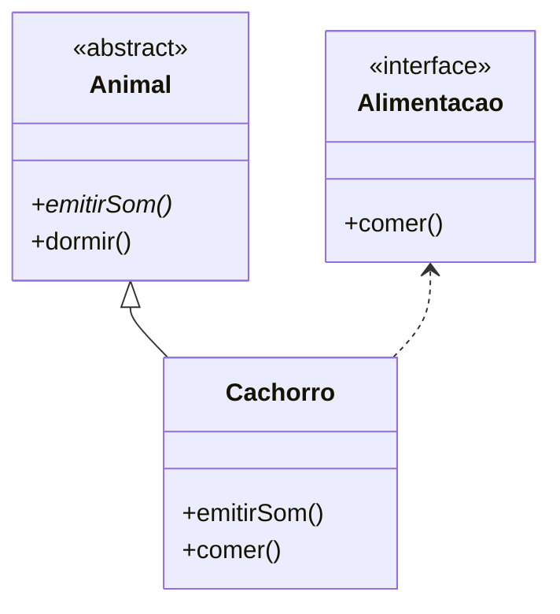

---

# ⚖️ Comparação entre **Classe Abstrata** e **Interface** em Java

## 🧩 1️⃣ Conceito Básico

| Conceito                  | Classe Abstrata                                                                | Interface                                                                                                 |
| ------------------------- | ------------------------------------------------------------------------------ | --------------------------------------------------------------------------------------------------------- |
| **Definição**             | Modelo base que pode conter **métodos abstratos e concretos**.                 | Contrato que define **o que uma classe deve fazer**, mas **não como**.                                    |
| **Objetivo**              | Reutilizar código e definir um comportamento base.                             | Garantir que várias classes diferentes sigam o mesmo conjunto de métodos.                                 |
| **Herança/Implementação** | Usada com `extends`.                                                           | Usada com `implements`.                                                                                   |
| **Instanciação**          | ❌ Não pode ser instanciada.                                                    | ❌ Não pode ser instanciada.                                                                               |
| **Métodos**               | Pode conter métodos **abstratos e concretos**.                                 | Contém apenas **métodos abstratos (implícitos)** até Java 7. Desde Java 8, pode ter **default e static**. |
| **Atributos**             | Pode conter atributos **com qualquer modificador** (private, protected, etc.). | Atributos são **sempre públicos, estáticos e finais** (`public static final`).                            |
| **Construtores**          | ✅ Pode ter construtores.                                                       | ❌ Não pode ter construtores.                                                                              |
| **Múltipla Herança**      | ❌ Java não permite herdar de várias classes abstratas.                         | ✅ Uma classe pode implementar várias interfaces.                                                          |

---

## 💡 2️⃣ Exemplo Prático Comparativo

### 🧱 Classe Abstrata

```java
abstract class Animal {
    abstract void emitirSom(); // método abstrato

    void dormir() { // método concreto
        System.out.println("O animal está dormindo...");
    }
}
```

### 🔷 Interface

```java
interface Alimentacao {
    void comer(); // método abstrato (por padrão public e abstract)
}
```

### 🐶 Classe Concreta que usa ambos

```java
class Cachorro extends Animal implements Alimentacao {

    @Override
    void emitirSom() {
        System.out.println("O cachorro late: Au Au!");
    }

    @Override
    public void comer() {
        System.out.println("O cachorro está comendo ração.");
    }
}

public class Principal {
    public static void main(String[] args) {
        Cachorro c = new Cachorro();
        c.emitirSom();
        c.comer();
        c.dormir();
    }
}
```

### 🖥️ Saída:

```
O cachorro late: Au Au!
O cachorro está comendo ração.
O animal está dormindo...
```

---

## 🧠 3️⃣ Diagrama UML Comparativo



---

### 🧩 Interpretação do Diagrama

| Elemento                   | Significado                                                         |                                            |
| -------------------------- | ------------------------------------------------------------------- | ------------------------------------------ |
| `<<abstract>>`             | Classe abstrata que pode conter métodos concretos e abstratos.      |                                            |
| `<<interface>>`            | Interface que define um contrato (apenas assinatura dos métodos).   |                                            |
| `Animal <                  | -- Cachorro`                                                        | Herança: `Cachorro` **herda** de `Animal`. |
| `Alimentacao <.. Cachorro` | Implementação: `Cachorro` **implementa** a interface `Alimentacao`. |                                            |

---

## ⚙️ 4️⃣ Quando Usar Cada Um

| Situação                                                          | Use Classe Abstrata | Use Interface                   |
| ----------------------------------------------------------------- | ------------------- | ------------------------------- |
| Quando quer compartilhar **código comum** entre subclasses.       | ✅                   | ❌                               |
| Quando quer apenas **definir um contrato** a ser seguido.         | ❌                   | ✅                               |
| Quando precisa de **métodos com corpo padrão**.                   | ✅                   | ✅ (desde Java 8, com `default`) |
| Quando precisa de **múltiplas heranças de comportamento**.        | ❌                   | ✅                               |
| Quando deseja usar **atributos com diferentes níveis de acesso**. | ✅                   | ❌ (todos públicos e finais)     |

---

## ✳️ 5️⃣ Resumo Final

| Característica              | Classe Abstrata        | Interface                                          |
| --------------------------- | ---------------------- | -------------------------------------------------- |
| Pode ter métodos abstratos? | ✅                      | ✅                                                  |
| Pode ter métodos concretos? | ✅                      | ✅ (desde Java 8 com `default`)                     |
| Pode ter atributos?         | ✅ Sim (qualquer tipo)  | ✅ Sim, mas **sempre públicos, estáticos e finais** |
| Pode ser instanciada?       | ❌ Não                  | ❌ Não                                              |
| Pode ter construtor?        | ✅ Sim                  | ❌ Não                                              |
| Permite múltipla herança?   | ❌ Não                  | ✅ Sim                                              |
| Palavras-chave              | `abstract` / `extends` | `interface` / `implements`                         |

---

### 🎓 Conclusão

* **Classe Abstrata** → usada para **compartilhar código base** e definir **comportamento parcial**.
* **Interface** → usada para **definir contratos** e **habilitar múltiplas implementações**.
* **Melhor prática moderna (Java 8+)**: combinar ambos quando necessário — usar **interfaces** para definir capacidades e **classes abstratas** para fornecer uma base de comportamento comum.

---
